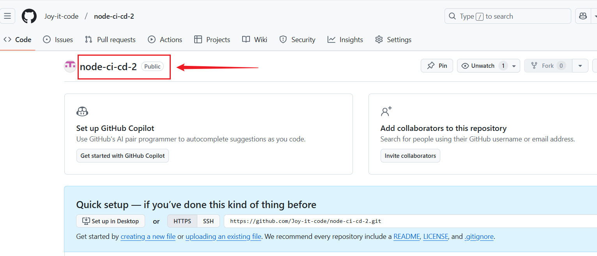
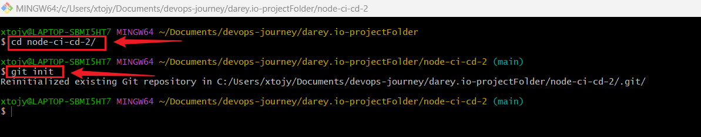
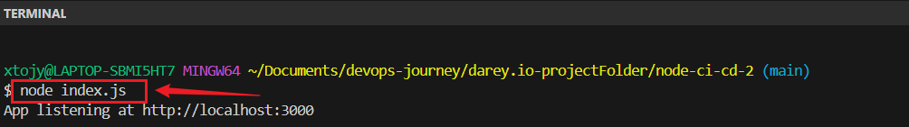
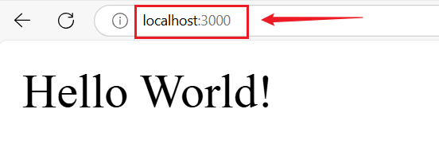
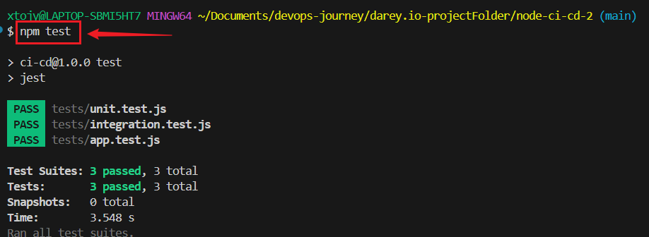
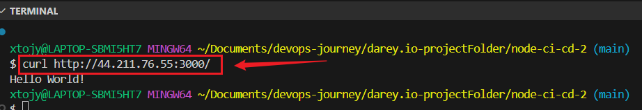

# Node.js CI/CD Pipeline with GitHub Actions & AWS EC2

## 🚀 Project Overview

This project implements a **Continuous Integration and Continuous Deployment (CI/CD)** pipeline using **GitHub Actions** to automate testing, building, and deploying a **Node.js** application.

## 🏗️ Features
- ✅ **Automated Testing** across **Node.js 18, 20, 21** & multiple OS.
- ✅ **GitHub Actions CI/CD** workflow.
- ✅ **Parallel Testing & Build Matrices** for faster execution.
- ✅ **Deployment to AWS EC2** via SSH.
- ✅ **Process Management with PM2**.

## 📂 **Project Structure**
📦 node-ci-cd ├── 📂 tests # Unit & Integration Tests │ ├── app.test.js # App tests │ ├── unit.test.js # Unit tests ├── 📜 index.js # Main entry file ├── 📜 package.json # Dependencies & scripts ├── 📜 .github/workflows # CI/CD Workflow file └── 📜 README.md # Documentation


## 🔹 Step 1: Understanding Build Matrices

A build matrix in GitHub Actions allows you to run the same job across multiple configurations (e.g., different Node.js versions, operating systems, or dependency versions). This is useful for ensuring your application works in various environments.

Why Use a Build Matrix?
Test across multiple Node.js versions.
Verify compatibility with different operating systems.
Run tests in parallel, speeding up execution.


---

## 🛠️ **Setup & Installation**
###  **Clone the Repository**

```
git init
cd node-ci-cd2
```




**Install Dependencies**
```
npm install
```

+ **Run the Application Locally**
```
node index.js
```
or
```
pm2 start index.js --name "node-app"
```



+ **On Browser:**
```
http://localhost:3000
```


+ **Run Tests**
```
npm test
```



✅ GitHub Actions CI/CD Workflow
This workflow:

+ Runs tests across Node.js 18, 20, and 21.
+ Executes tests on Ubuntu, macOS, and Windows.
+ Deploys to AWS EC2 only if all tests pass.

## **Parallel and Matrix Builds:**
Test across multiple Node.js versions:
```
 steps:
      - name: Checkout Repository
        uses: actions/checkout@v4

      - name: Set up Node.js ${{ matrix.node-version }}
        uses: actions/setup-node@v4
        with:
          node-version: ${{ matrix.node-version }}
```
+ Runs npm test in 9 environments (3 Node.js versions × 3 OS).


## Updated GitHub Actions Workflow
Update .github/workflows/deploy.yml:
```
name: Deploy to AWS EC2

on:
  push:
    branches:
      - main

jobs:
  test:
    name: Run Tests on Multiple Environments
    runs-on: ${{ matrix.os }}

    strategy:
      matrix:
        node-version: [18, 20, 21]
        os: [ubuntu-latest, macos-latest, windows-latest]

    steps:
      - name: Checkout Repository
        uses: actions/checkout@v4

      - name: Set up Node.js ${{ matrix.node-version }}
        uses: actions/setup-node@v4
        with:
          node-version: ${{ matrix.node-version }}

      - name: Install Dependencies
        run: npm ci

      - name: Run Tests
        run: npm test

  deploy:
    name: Deploy to AWS EC2
    runs-on: ubuntu-latest
    needs: test # Ensure deployment happens only if tests pass

    steps:
      - name: Checkout Repository
        uses: actions/checkout@v4

      - name: Set up SSH Key
        run: |
          mkdir -p ~/.ssh
          echo "${{ secrets.EC2_SSH_KEY }}" > ~/.ssh/ci-cd-key
          chmod 600 ~/.ssh/ci-cd-key
          ssh-keyscan 44.201.195.99 >> ~/.ssh/known_hosts

      - name: Deploy to AWS EC2
        uses: appleboy/ssh-action@master
        with:
          host: ${{ secrets.EC2_HOST }}
          username: ubuntu
          key: ${{ secrets.EC2_SSH_KEY }}
          script: |
            cd ~/node-ci-cd || git clone https://github.com/Joy-it-code/node-ci-cd-2.git ~/node-ci-cd2
            cd ~/node-ci-cd-2
            git pull origin main
            npm install
            pm2 restart index.js || pm2 start index.js --name "node-app"
```

## **✅ Parallel Execution**
Each job runs simultaneously in different environments.
This speeds up the testing process.


## **✅ Deployment Step**
```
needs: test
```
+ Ensures deployment occurs ONLY if tests pass.

## **☁️ Deploying to AWS EC2**
1️⃣ SSH into EC2
```
ssh -i "/c/Users/xtojy/.ssh/ci-cd-key.pem" ubuntu@<your-ec2-public-ip>
```

### **Clone Repository**
```
git clone https://github.com/your-username/node-ci-cd.git
cd node-ci-cd-2
```

### **Install Dependencies & Start App**
```
npm install
pm2 start index.js --name "node-app"
```

## **🔍 Verify Deployment**
✅ Check via Terminal
```
curl http://<your-ec2-public-ip>:3000/
```



**Check in Browser**
```
http://<your-ec2-public-ip>:3000/
```

## **Test the workflow**

Push changes to the main branch and check the Actions tab in GitHub to monitor the deployment process.

## Conclusion
This project automates CI/CD using GitHub Actions and AWS EC2, ensuring reliable deployments with testing across multiple environments. 🚀


**📌 Author: Joy Nwatuzor**

**🎉 Happy Coding! 🚀**