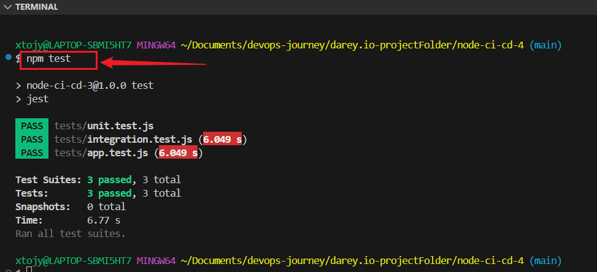
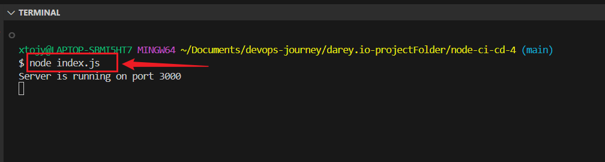
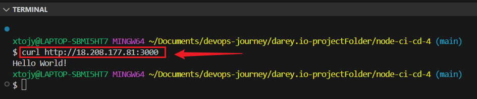
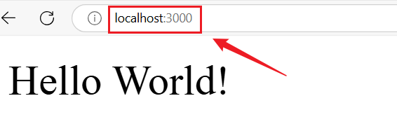
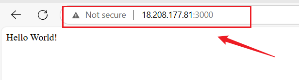

# 🚀 Node.js CI/CD Pipeline with GitHub Actions  

This repository contains a Node.js application with a fully automated CI/CD pipeline using GitHub Actions. It includes automated testing, versioning, and deployment to AWS EC2.

---

## 📌 **Table of Contents**
- [Introduction](#introduction)
- [Deployment Pipeline](#deployment-pipeline)
- [Automated Releases & Versioning](#automated-releases--versioning)
- [Deploying to AWS](#deploying-to-aws)
- [Troubleshooting & Resources](#troubleshooting--resources)

---

## 🎯 **Introduction**
This project demonstrates a modern DevOps workflow using GitHub Actions. It follows best practices for:
- Automated testing with ESLint and Jest
- Semantic versioning for releases
- Zero-downtime deployment to AWS

---

## 🏗 **Deployment Pipeline**
Our deployment pipeline consists of the following stages:

1. **Development** – Writing and testing code in a local environment.
2. **Integration** – Merging changes into a shared branch.
3. **Testing** – Running automated tests to ensure stability.
4. **Staging** – Deploying to a pre-production environment.
5. **Production** – Releasing to end-users.

### 📌 **Deployment Strategies**
- **Blue-Green Deployment** – Two environments (Blue & Green) ensure zero-downtime releases.
- **Canary Releases** – Incremental rollout to small user groups.
- **Rolling Deployment** – Gradual replacement of older instances.

---

## 🔄 **Automated Releases & Versioning**
### ✅ **Semantic Versioning (SemVer)**
I use SemVer (MAJOR.MINOR.PATCH) for versioning:
- **MAJOR** – Breaking changes.
- **MINOR** – Backward-compatible features.
- **PATCH** – Bug fixes.

### ✅ **GitHub Actions for Auto Versioning**
GitHub Actions automatically bumps the version and tags commits.

#### **GitHub Actions Versioning Script**
**Create a new workflow file called .github/workflows/bump-version.yml:**
```yaml
name: Bump version and tag
on:
  push:
    branches:
      - main

jobs:
  build:
    runs-on: ubuntu-latest
    steps:
      - name: Checkout code
        uses: actions/checkout@v4

      - name: Bump version and push tag
        uses: anothrNick/github-tag-action@1.26.0
        env:
          GITHUB_TOKEN: ${{ secrets.GITHUB_TOKEN }}
          DEFAULT_BUMP: patch ## Options: major, minor, patch
```
+ Each push to main automatically increments the patch version.


## ☁️ Deploying to AWS
Step 1: Set Up AWS Deployment Workflow
I use GitHub Actions to deploy to AWS EC2.

**AWS Deployment Workflow**
```
name: Node.js CI/CD Pipeline

on:
  push:
    branches:
      - main
  pull_request:
    branches:
      - main

jobs:
  build:
    runs-on: ubuntu-latest

    strategy:
      matrix:
        node-version: [16.x, 18.x, 20.x]

    steps:
      - name: Checkout repository
        uses: actions/checkout@v2

      - name: Set up Node.js ${{ matrix.node-version }}
        uses: actions/setup-node@v2
        with:
          node-version: ${{ matrix.node-version }}

      - name: Cache node modules
        uses: actions/cache@v2
        with:
          path: ~/.npm
          key: ${{ runner.os }}-node-${{ matrix.node-version }}-node_modules-${{ hashFiles('**/package-lock.json') }}
          restore-keys: |
            ${{ runner.os }}-node-${{ matrix.node-version }}-node_modules-

      - name: Install dependencies
        run: npm ci

      - name: Run ESLint
        run: npm run lint

      - name: Run tests
        run: npm test

      # Add SSH key and set up known hosts
      - name: Set up SSH key
        run: |
          mkdir -p ~/.ssh
          echo "${{ secrets.CI_SSH_PRIVATE_KEY }}" > ~/.ssh/id_rsa
          chmod 600 ~/.ssh/id_rsa
          ssh-keyscan -H your-server-ip-or-hostname >> ~/.ssh/known_hosts

      - name: Deploy to Server (SSH)
        run: |
          ssh -i ~/.ssh/id_rsa ubuntu@your-server-ip-or-hostname << 'EOF'
          # Your deployment commands here
          EOF
```
This workflow deploys the latest code to AWS when changes are pushed to main.


**Run test On Terminal:**
```
npm test
node index.js
curl http://18.208.177.81:3000
```





**Run test On Browser:**
```
http://localhost:3000
http://18.208.177.81:3000
```



---

**Test Your Deployment**
Push changes to main branch
```
git add .
git commit -m "Test CI/CD"
git push origin main
```

## 🛠 Troubleshooting & Resources

✅ GitHub Actions Logs – Check logs for error details.

✅ YAML Validator – Validate workflow files using YAML Lint.

✅ GitHub Secrets – Ensure AWS credentials and SSH keys are correctly set.

✅ PM2 Logs – Run pm2 logs on the server to debug issues.
---


---
## 🎯 Conclusion
By following this guide, I have successfully set up a CI/CD pipeline to automate the deployment of a Node.js application to AWS EC2 using GitHub Actions. This pipeline ensures that every change pushed to the main branch undergoes automated testing, versioning, and seamless deployment, reducing manual effort and minimizing deployment risks.
---


  **Author: Joy Nwatuzor** 

**🎉Happy Coding & Automating! 🚀**
